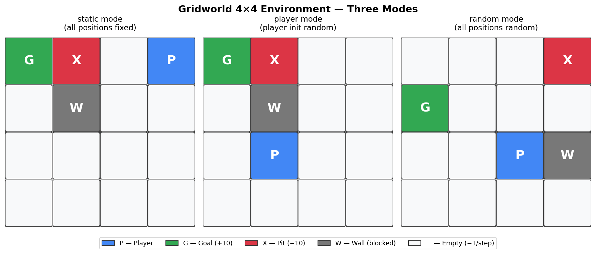
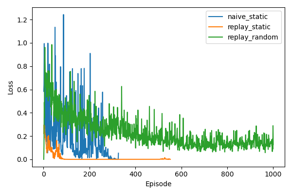

# 實驗環境說明
- **Gridworld 4x4**：4x4 棋盤，狀態由 Player、Goal、Pit、Wall 的位置組成。
	- **行為空間**：上/下/左/右（u/d/l/r）。
	- **終止條件**：抵達 Goal（成功）或掉入 Pit（失敗）。
	- **獎勵**：Goal = +10、Pit = -10、其餘步驟 = -1。
	- **牆與邊界**：撞牆或越界不會移動。

# Mode 說明
- **static mode**：Goal、Pit、Wall 位置固定，Player 初始位置固定。
- **random mode**：Player、Goal、Pit、Wall 位置隨機初始化（需通過合法棋盤檢查）。
- **player mode**：Goal、Pit、Wall 固定，Player 初始位置隨機初始化。


# HW3-1 報告（Naive DQN / Replay）

## 實驗目標
本實驗旨在探討 **Experience Replay** 機制對 Deep Q-Network（DQN）訓練穩定性與策略品質的影響。透過在相同的 Gridworld 4x4 環境中，比較三種設定的學習行為：

1. **Naive DQN（static）**：不使用 Replay Buffer，以 online 方式逐步更新，觀察訓練是否容易震盪與發散。
2. **DQN + Replay（static）**：加入 Experience Replay，場景固定，驗證 Replay 機制是否能顯著提升收斂速度與成功率。
3. **DQN + Replay（random）**：加入 Experience Replay，場景隨機初始化，評估模型在動態環境下的泛化能力。


## 實驗結果
| Experiment | Mean Reward | Success Rate | Mean Steps | Mean Loss |
| --- | --- | --- | --- | --- |
| naive_static | -11.25 | 0.00 | 2.25 | 0.0056 |
| replay_static | 3.70 | 1.00 | 7.30 | 0.0016 |
| replay_random | -4.10 | 0.77 | 11.63 | 0.1143 |

- **Naive static**：Mean Reward 偏低且 Success Rate 為 0，代表最終回合多數未成功，且平均步數較短（較早失敗）。
- **Replay static**：Success Rate = 1.00 且 Mean Reward 為正，代表穩定到達目標且路徑效率較佳。
- **Replay random**：Success Rate 中等、Mean Reward 仍偏低，顯示隨機場景難度較高，但 Replay 仍能提供一定程度的穩定性。

### Loss 對照

1. **Naive DQN (static)**：由於缺乏 Replay Buffer，訓練樣本間存在高度時間相關性，容易導致 Loss 發生震盪且難以穩定下降，模型可能會出現災難性遺忘或陷入局部最佳解，這也反映在其極低的成功率上。
2. **DQN + Replay (static)**：加入 Experience Replay 後成功打破樣本相關性，Loss 曲線能呈現較為平滑且穩定的下降趨勢，最終收斂至極低的數值，模型也成功學習到靜態環境的最佳策略，達到 100% 成功率。
3. **DQN + Replay (random)**：雖然同樣使用了 Replay Buffer，但由於每回合場景配置隨機初始化，狀態與最佳策略不斷變動，這使得訓練難度大幅提升。因此 Loss 曲線會比 static 模式更高且伴隨較大波動，但模型最終仍能收斂並具備泛化能力，達到不錯的成功率。


## 訓練期間策略優化
> 依各模型實際訓練總回合數，選取 $\approx$ 25% / 50% / 75% / 100% 的回合作為觀察點。

### Naive DQN（static，總回合 326）
| Episode 50 | Episode 150 | Episode 250 | Episode 300 |
| --- | --- | --- | --- |
|  |  |  |  |

### DQN + Replay（static，總回合 552）
| Episode 150 | Episode 300 | Episode 400 | Episode 550 |
| --- | --- | --- | --- |
|  |  |  |  |

### DQN + Replay（random，總回合 1000）
| Episode 250 | Episode 500 | Episode 750 | Episode 1000 |
| --- | --- | --- | --- |
|  |  |  |  |

- **Naive static**：整體而言，策略仍偏向隨機探索，策略改進有限。
- **Replay static**：隨著回合數提升，策略能更穩定地到達目標，且路徑也變得更為一致。
- **Replay random**：環境較複雜，策略不穩定。

## 討論與比較
1. **Replay static** 明顯提升成功率並達到穩定收斂。
2. **Naive static** 收斂不穩定，成功率偏低。
3. **Replay random** 在隨機環境中仍能學到策略，但回饋較不穩定。


## 總結：為什麼需要 Replay Buffer

**Replay Buffer（經驗回放緩衝區）** 是 DQN 中的關鍵機制，用來儲存智能體與環境互動的歷史經驗。每次執行動作後，會將該次資料記錄為 tuple：

```
(state, action, reward, next_state, done)
```

訓練時從 buffer 中**隨機抽取 mini-batch** 來更新 Q-network，而非直接使用當下資料。

| 問題 | Replay Buffer 的解法 |
|------|----------------------|
| 相鄰時間步樣本高度相關（non-i.i.d.） | 隨機抽樣打破時間相關性 |
| Online 更新每筆資料只用一次 | 過去的經驗可被重複取樣學習 |
| 訓練不穩定、容易震盪 | Mini-batch 梯度更新更穩定 |

從本實驗結果可清楚驗證：加入 Replay Buffer 的 `replay_static` 達到 **100% 成功率**，而未使用的 `naive_static` 則完全無法收斂；即使在較困難的隨機場景（`replay_random`）下，Replay Buffer 仍能提供一定的穩定性與泛化能力。
