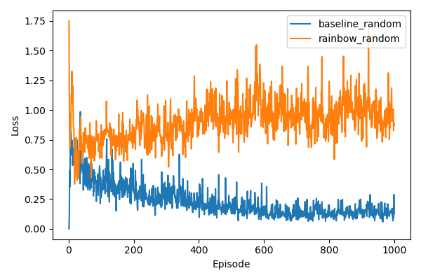

# HW3-4 報告（Rainbow DQN）

## 實驗目標
本實驗旨在探討將多種 DQN 改良技術整合為 **Rainbow DQN** 後，在 Gridworld 4x4（random mode）隨機環境下的實際表現。以標準 DQN + Replay（Baseline）為對照，分析 Rainbow DQN 的五種核心技術是否能在複雜、多變的場景中帶來顯著的性能提升，並探討各技術在小型環境中的潛在限制。

## Rainbow DQN 技術構成與原理說明

Rainbow DQN（Hessel et al., 2017）整合了六項 DQN 改良技術（本實驗實作其中五項），各技術原理如下：

### 1. Double DQN
解決標準 DQN 的 **Q 值過度估計（overestimation bias）**問題。使用線上網路（online network）選擇動作，目標網路（target network）評估價值，避免高估：

$$Q\text{-target} = r + \gamma Q_{\text{target}}\!\left(s',\, \arg\max_{a'} Q_{\text{online}}(s', a')\right)$$

### 2. Dueling Network
將 Q-network 的輸出拆分為兩個分支，分別估計**狀態價值 $V(s)$** 與**動作優勢 $A(s, a)$**：

$$Q(s, a) = V(s) + \left(A(s, a) - \frac{1}{|A|}\sum_{a'} A(s, a')\right)$$

這讓模型能在不依賴特定動作的情況下學到「哪些狀態本身重要」，提升樣本效率。

### 3. NoisyNet（Noisy Networks）
以**可學習的參數化雜訊（parametric noise）**取代傳統的 ε-greedy 探索策略，雜訊直接加在網路權重上：

$$y = (\mu^w + \sigma^w \odot \epsilon^w)x + (\mu^b + \sigma^b \odot \epsilon^b)$$

網路會自動學習何時需要探索（high noise）、何時應收斂利用（low noise），探索策略更具適應性。

### 4. Prioritized Experience Replay（PER）
標準 Replay Buffer 以均勻分布抽樣，PER 改為**根據 TD Error 大小分配抽樣優先度**：

$$P(i) = \frac{p_i^\alpha}{\sum_k p_k^\alpha}$$

TD Error 大的樣本代表模型尚未學好這段經驗，賦予更高抽樣機率，可更有效利用 buffer 中的資料。

### 5. Multi-step Learning（n-step Returns）
將 1-step TD target 延伸為 n-step 累積回饋，讓梯度訊號傳遞更遠：

$$G_t^{(n)} = \sum_{k=0}^{n-1} \gamma^k r_{t+k} + \gamma^n Q(s_{t+n}, a^*)$$

n-step return 能更快將終端獎勵的訊號傳遞回較早的狀態，加速策略改善。

## 實驗結果
### Loss 對照

| Experiment | Mean Reward | Success Rate | Mean Steps | Mean Loss |
| --- | --- | --- | --- | --- |
| baseline_random | -10.83 | 0.70 | 17.63 | 0.1419 |
| rainbow_random | -17.23 | 0.57 | 21.97 | 0.9655 |

1. **Baseline（DQN + Replay）**：在 random mode 下，Loss 曲線整體偏高但仍能在訓練過程中逐漸收斂，最終 Mean Loss 約為 0.1419。相較於 static mode，隨機初始化使訓練更不穩定，但均勻抽樣的 Replay Buffer 在此環境中反而能提供較均衡的學習信號，成功率達 70%。

2. **Rainbow DQN**：由於 PER 優先抽取高 TD Error 的樣本、NoisyNet 引入持續性參數雜訊、multi-step return 延伸訓練目標，這些機制的交互作用使訓練動態更為複雜。Loss 曲線波動明顯且最終值高達 0.9655，遠超 Baseline。在小型環境中，多重機制疊加可能導致梯度信號不穩定，學習效率反而降低，成功率僅達 57%。

## 訓練期間策略優化
> 依各模型實際訓練總回合數（1000 回合），選取 $\approx$ 25% / 50% / 75% / 100% 的回合作為觀察點。

### Baseline（DQN + Replay，總回合 1000）
| Episode 250 | Episode 500 | Episode 750 | Episode 1000 |
| --- | --- | --- | --- |
|  |  |  |  |

### Rainbow DQN（總回合 1000）
| Episode 250 | Episode 500 | Episode 750 | Episode 1000 |
| --- | --- | --- | --- |
|  |  |  |  |

- **Baseline**：隨著訓練推進，策略逐漸能在隨機環境中找到可行路徑，但仍受隨機初始位置干擾，路徑一致性有限。
- **Rainbow DQN**：早期策略受 NoisyNet 雜訊影響，行為較不規律；中後期雖能學到部分有效策略，但整體穩定性仍低於 Baseline，反映多機制疊加在此環境下的訓練困難。

## 討論與比較

### 1. Rainbow 在小型環境的適應性問題

Rainbow DQN 的設計初衷是應對 **Atari 等高維度、長時程**的複雜環境。在 Gridworld 4x4（random mode）這樣的小型離散環境中，多種機制的疊加卻帶來了反效果：

| 機制 | 在複雜環境的效益 | 在小型環境的潛在問題 |
|------|---------------|------------------|
| PER | 聚焦困難樣本，提升學習效率 | 可能過度聚焦某些狀態，破壞均勻覆蓋 |
| NoisyNet | 適應性探索，減少超參數調整 | 在少量狀態空間中引入過多不必要雜訊 |
| Multi-step | 加速長程信號傳遞 | n-step return 在短回合中可能引入高方差 |
| Dueling | 分離狀態與動作估計 | 效益在動作空間很小時較不顯著 |
| Double | 降低高估偏差 | 本身較中性，影響相對有限 |

### 2. Loss 高度差異的原因分析

Rainbow 的 Mean Loss（0.9655）相較 Baseline（0.1419）高出約 6.8 倍。主要原因包含：

- **PER 的非均勻抽樣**：高優先度樣本被重複學習，使梯度更新方向不均衡，Loss 難以穩定下降。
- **NoisyNet 的持續雜訊**：網路參數本身帶有雜訊，輸出的 Q 值估計方差更大，導致 Loss 數值整體偏高。
- **Multi-step target 的高方差**：隨機環境中，n-step return 對未來的估計誤差會隨 n 增大，增加訓練不穩定性。

### 3. 成功率與 Mean Reward 的落差

Baseline 成功率（70%）高於 Rainbow（57%），但這並不代表 Rainbow 架構的理論缺陷。在 random mode 中，每回合的初始位置均隨機，Rainbow 的探索策略（NoisyNet）可能導致策略在某些配置下過度探索而失敗。若訓練回合數增加至 2000–5000 或針對 NoisyNet 的 sigma 初始值與 PER 的 α/β 係數進行調參，Rainbow 有機會展現其真正優勢。

## 總結

本實驗結果揭示了一個重要的觀察：**複雜演算法在簡單環境中不一定優於簡單方法**。

- **Baseline** 在此設定下以更低的訓練複雜度達到更高的成功率（70% vs 57%）與更低的 Loss，顯示在小型、低維度的 Gridworld 環境中，標準的 DQN + Replay 已具備足夠的表達能力。

- **Rainbow DQN** 的五種技術均有其理論依據，在大型、高維度環境（如 Atari）中已被驗證能大幅提升表現。然而，將這些機制直接移植至小型環境時，各技術的超參數需要重新針對環境規模調整，否則容易出現「機制相互干擾」的現象，反而降低訓練效率。

- 此實驗提醒我們：演算法選擇應與**環境複雜度**相匹配。未來若要讓 Rainbow 發揮優勢，建議從以下方向改進：
  1. 降低 NoisyNet 的初始雜訊強度（σ₀）
  2. 調整 PER 的優先度係數 α（建議從 0.4–0.5 開始）與重要性採樣修正係數 β
  3. 使用較小的 n-step（如 n=2 或 n=3）以降低 return 估計的方差
  4. 增加訓練回合數至 2000 回合以上，讓 Rainbow 有足夠時間收斂
