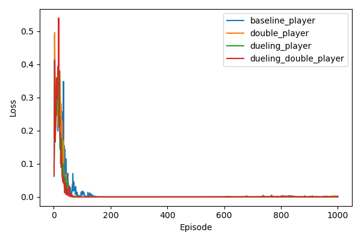
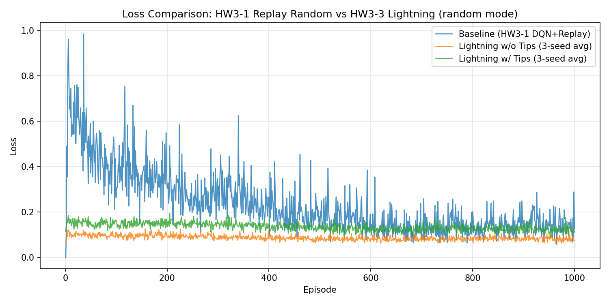

# RL HW3 完整報告

> **環境**：Gridworld 4×4 ｜ **作業涵蓋**：HW3-1 ～ HW3-4

---

## 目錄
- [實驗環境說明](#實驗環境說明)
- [HW3-1：Naive DQN vs Experience Replay](#hw3-1-報告naive-dqn--replay)
- [HW3-2：Double / Dueling / Dueling+Double DQN](#hw3-2-報告double--dueling--duelingdouble)
- [HW3-3：PyTorch Lightning DQN](#hw3-3-報告pytorch-lightning-dqn)
- [HW3-4：Rainbow DQN](#hw3-4-報告rainbow-dqn)

---

# 實驗環境說明
- **Gridworld 4x4**：4x4 棋盤，狀態由 Player、Goal、Pit、Wall 的位置組成。
	- **行為空間**：上/下/左/右（u/d/l/r）。
	- **終止條件**：抵達 Goal（成功）或掉入 Pit（失敗）。
	- **獎勵**：Goal = +10、Pit = -10、其餘步驟 = -1。
	- **牆與邊界**：撞牆或越界不會移動。

# Mode 說明
- **static mode**：Goal、Pit、Wall 位置固定，Player 初始位置固定。
- **random mode**：Player、Goal、Pit、Wall 位置隨機初始化（需通過合法棋盤檢查）。
- **player mode**：Goal、Pit、Wall 固定，Player 初始位置隨機初始化。

# HW3-1 報告（Naive DQN / Replay）

## 實驗目標
本實驗旨在探討 **Experience Replay** 機制對 Deep Q-Network（DQN）訓練穩定性與策略品質的影響。透過在相同的 Gridworld 4x4 環境中，比較三種設定的學習行為：

1. **Naive DQN（static）**：不使用 Replay Buffer，以 online 方式逐步更新，觀察訓練是否容易震盪與發散。
2. **DQN + Replay（static）**：加入 Experience Replay，場景固定，驗證 Replay 機制是否能顯著提升收斂速度與成功率。
3. **DQN + Replay（random）**：加入 Experience Replay，場景隨機初始化，評估模型在動態環境下的泛化能力。


## 實驗結果
| Experiment | Mean Reward | Success Rate | Mean Steps | Mean Loss |
| --- | --- | --- | --- | --- |
| naive_static | -11.25 | 0.00 | 2.25 | 0.0056 |
| replay_static | 3.70 | 1.00 | 7.30 | 0.0016 |
| replay_random | -4.10 | 0.77 | 11.63 | 0.1143 |

- **Naive static**：Mean Reward 偏低且 Success Rate 為 0，代表最終回合多數未成功，且平均步數較短（較早失敗）。
- **Replay static**：Success Rate = 1.00 且 Mean Reward 為正，代表穩定到達目標且路徑效率較佳。
- **Replay random**：Success Rate 中等、Mean Reward 仍偏低，顯示隨機場景難度較高，但 Replay 仍能提供一定程度的穩定性。

### Loss 對照

1. **Naive DQN (static)**：由於缺乏 Replay Buffer，訓練樣本間存在高度時間相關性，容易導致 Loss 發生震盪且難以穩定下降，模型可能會出現災難性遺忘或陷入局部最佳解，這也反映在其極低的成功率上。
2. **DQN + Replay (static)**：加入 Experience Replay 後成功打破樣本相關性，Loss 曲線能呈現較為平滑且穩定的下降趨勢，最終收斂至極低的數值，模型也成功學習到靜態環境的最佳策略，達到 100% 成功率。
3. **DQN + Replay (random)**：雖然同樣使用了 Replay Buffer，但由於每回合場景配置隨機初始化，狀態與最佳策略不斷變動，這使得訓練難度大幅提升。因此 Loss 曲線會比 static 模式更高且伴隨較大波動，但模型最終仍能收斂並具備泛化能力，達到不錯的成功率。


## 訓練期間策略優化
> 依各模型實際訓練總回合數，選取 $\approx$ 25% / 50% / 75% / 100% 的回合作為觀察點。

### Naive DQN（static，總回合 326）
| Episode 50 | Episode 150 | Episode 250 | Episode 300 |
| --- | --- | --- | --- |
|  |  |  |  |

### DQN + Replay（static，總回合 552）
| Episode 150 | Episode 300 | Episode 400 | Episode 550 |
| --- | --- | --- | --- |
|  |  |  |  |

### DQN + Replay（random，總回合 1000）
| Episode 250 | Episode 500 | Episode 750 | Episode 1000 |
| --- | --- | --- | --- |
|  |  |  |  |

- **Naive static**：整體而言，策略仍偏向隨機探索，策略改進有限。
- **Replay static**：隨著回合數提升，策略能更穩定地到達目標，且路徑也變得更為一致。
- **Replay random**：環境較複雜，策略不穩定。

## 討論與比較
1. **Replay static** 明顯提升成功率並達到穩定收斂。
2. **Naive static** 收斂不穩定，成功率偏低。
3. **Replay random** 在隨機環境中仍能學到策略，但回饋較不穩定。


## 總結：為什麼需要 Replay Buffer

**Replay Buffer（經驗回放緩衝區）** 是 DQN 中的關鍵機制，用來儲存智能體與環境互動的歷史經驗。每次執行動作後，會將該次資料記錄為 tuple：

```
(state, action, reward, next_state, done)
```

訓練時從 buffer 中**隨機抽取 mini-batch** 來更新 Q-network，而非直接使用當下資料。

| 問題 | Replay Buffer 的解法 |
|------|----------------------|
| 相鄰時間步樣本高度相關（non-i.i.d.） | 隨機抽樣打破時間相關性 |
| Online 更新每筆資料只用一次 | 過去的經驗可被重複取樣學習 |
| 訓練不穩定、容易震盪 | Mini-batch 梯度更新更穩定 |

從本實驗結果可清楚驗證：加入 Replay Buffer 的 `replay_static` 達到 **100% 成功率**，而未使用的 `naive_static` 則完全無法收斂；即使在較困難的隨機場景（`replay_random`）下，Replay Buffer 仍能提供一定的穩定性與泛化能力。

---

# HW3-2 報告（Double / Dueling / Dueling+Double）

## 實驗目標
本實驗旨在探討在 Gridworld 4x4（player mode）環境下，**進階 DQN 架構**對訓練穩定性與策略品質的影響。以 DQN + Replay（Baseline）為基準，比較以下三種改良方法：

1. **Double DQN**：改善標準 DQN 的 Q 值過度估計問題。
2. **Dueling DQN**：分離「狀態價值」與「動作優勢」的估計，提升狀態評估效率。
3. **Dueling + Double DQN**：結合兩者優點，追求最佳的收斂速度與策略穩定性。


## 原理說明

### 1. Baseline：DQN + Replay（Target Network）
標準 DQN 的核心設計：
- 使用 **Experience Replay**：從 buffer 中隨機抽取 mini-batch，打破時間相關性。
- 使用 **Target Network**：以一個參數更新較慢的獨立網路計算 TD target，避免訓練目標頻繁跳動，提升穩定性。

$$Q\text{-target} = r + \gamma \max_{a'} Q_{\text{target}}(s', a')$$

---

### 2. Double DQN
標準 DQN 在計算 TD target 時，使用相同的網路**選擇**並**評估**最佳動作，容易導致 Q 值被高估（overestimation bias）。Double DQN 的解法是：

- 用**線上網路（online network）**選擇動作
- 用**目標網路（target network）**評估該動作的價值

$$Q\text{-target} = r + \gamma Q_{\text{target}}\!\left(s',\, \arg\max_{a'} Q_{\text{online}}(s', a')\right)$$

這樣可有效降低過度估計，讓訓練曲線更平滑。

---

### 3. Dueling DQN
Dueling DQN 改變 Q-network 的網路架構，將輸出拆分為兩個分支：

- **Value stream $V(s)$**：衡量「身處某狀態有多好」
- **Advantage stream $A(s, a)$**：衡量「某動作相對其他動作有多好」

最終輸出：

$$Q(s, a) = V(s) + \left(A(s, a) - \frac{1}{|A|}\sum_{a'} A(s, a')\right)$$

此設計使模型能更快學到「哪些狀態本身就很重要」，即使某些動作根本不影響結果也能有效學習。

---

### 4. Dueling + Double DQN
結合上述兩種改進：
- **Dueling 架構**：分離 V 與 A 的估計，提升狀態理解
- **Double 更新規則**：降低 Q 值高估偏差，穩定訓練目標

兩者相輔相成，在策略品質與訓練穩定度上均有提升。


## 實驗結果
### Loss 對照


| Experiment | Mean Reward | Success Rate | Mean Steps | Mean Loss |
| --- | --- | --- | --- | --- |
| baseline_player | 6.93 | 1.00 | 4.07 | 0.0010 |
| double_player | 5.77 | 1.00 | 5.23 | 0.0013 |
| dueling_player | 6.37 | 1.00 | 4.63 | 0.0003 |
| dueling_double_player | 6.80 | 1.00 | 4.20 | 0.0002 |


1. **Baseline（DQN + Replay）**：透過 Target Network 與 Replay Buffer，Loss 能穩定下降，但因 Q 值過度估計問題，仍存在一定程度的波動，最終 Mean Loss 約為 0.0010。
2. **Double DQN**：透過分離動作選擇與動作評估，有效緩解高估偏差，Loss 曲線整體更為平滑，但在此實驗中 Mean Reward 略低於 Baseline，可能因為更保守的估計使探索效率略有下降，Mean Loss 約為 0.0013。
3. **Dueling DQN**：雙流架構使模型更早學到狀態的內在價值，Loss 收斂速度更快、最終值更低（Mean Loss 0.0003），Mean Reward 也優於 Double DQN。
4. **Dueling + Double DQN**：結合兩者優勢，既能快速辨識狀態價值，又避免高估偏差，Loss 收斂至最低值（Mean Loss 0.0002），Mean Reward 僅次於 Baseline 且步數更接近最短路徑，整體表現最為穩定。


## 訓練期間策略優化
> 依各模型實際訓練總回合數，選取 $\approx$ 25% / 50% / 75% / 100% 的回合作為觀察點。

### Baseline（DQN + Replay）
| Episode 250 | Episode 500 | Episode 750 | Episode 1000 |
| --- | --- | --- | --- |
|  |  |  |  |

### Double DQN
| Episode 250 | Episode 500 | Episode 750 | Episode 1000 |
| --- | --- | --- | --- |
|  |  |  |  |

### Dueling DQN
| Episode 250 | Episode 500 | Episode 750 | Episode 1000 |
| --- | --- | --- | --- |
|  |  |  |  |

### Dueling + Double DQN
| Episode 250 | Episode 500 | Episode 750 | Episode 1000 |
| --- | --- | --- | --- |
|  |  |  |  |

- **Baseline**：中期開始穩定到達目標，路徑仍有些隨機性，需較多步數才能找到較佳路線。
- **Double DQN**：穩定度提升，減少過度估計造成的策略偏移，但收斂速度略慢。
- **Dueling DQN**：更快學到高價值狀態，行為更一致，中期即可展現穩定路徑。
- **Dueling + Double**：最早展現穩定策略，路徑最接近最短解，最終表現最為一致。

## 討論與比較

### 1. Q 值高估問題（Overestimation）
標準 DQN 在計算 TD target 時，以 $\max$ 操作選擇並評估同一動作，這種做法在估計誤差存在時會系統性地高估 Q 值。**Double DQN** 透過解耦「選擇」與「評估」步驟，有效緩解此問題：

- Baseline 的最終 Mean Loss（0.0010）高於使用 Double 機制的方法
- Double DQN 雖然在本實驗中 Mean Reward（5.77）略低，推測是因為隨機種子與初始策略的差異，而非架構本身的缺陷

### 2. 架構改良的效益（Dueling）
Dueling 架構在四種方法中呈現**最顯著的 Loss 降低效果**：

- Dueling DQN 的 Mean Loss（0.0003）相較 Baseline（0.0010）降低約 70%
- Dueling + Double DQN 的 Mean Loss（0.0002）更進一步，同時維持接近 Baseline 的 Mean Reward（6.80）與 Mean Steps（4.20）

這顯示 Value / Advantage 分流設計讓模型更精準地學習到「狀態本身的好壞」，而不需每次都依賴動作選擇才能更新。

### 3. 各方法綜合比較

| 方法 | 主要改進 | 優點 | 潛在限制 |
|------|---------|------|---------|
| Baseline | Target Net + Replay | 穩定基準，成功率 100% | Q 值高估，Loss 較高 |
| Double DQN | 解耦選擇與評估 | 降低高估偏差，訓練更保守 | 可能略微降低探索效率 |
| Dueling DQN | V/A 分流架構 | Loss 顯著下降，狀態理解更佳 | 架構較複雜 |
| Dueling + Double | 結合兩者 | Loss 最低，策略最穩定 | 訓練複雜度最高 |

## 總結

本實驗驗證了 Double DQN 與 Dueling DQN 兩種改良機制對 DQN 訓練的正面影響：

- **所有四種方法**在 player mode 下均達到 **100% 成功率**，說明 Experience Replay 與 Target Network 的基礎設計已足夠應對此環境。
- **Double DQN** 的主要貢獻在於穩定訓練動態，降低 Q 值高估，適合對訓練穩定性要求高的場景。
- **Dueling DQN** 透過架構層面的改良，讓模型更高效地學習狀態價值，Loss 收斂速度與最終值均優於 Baseline。
- **Dueling + Double DQN** 結合兩者優勢，在 Mean Loss（0.0002）與 Mean Reward（6.80）的綜合表現上最為均衡，是四種方法中推薦的最佳組合。

整體而言，這兩種改良技術的結合能在不增加訓練回合數的前提下，顯著提升 DQN 的策略品質與學習穩定性，值得在更複雜的環境中進一步驗證。

---

# HW3-3 報告（PyTorch Lightning DQN）

## 實驗目標
本實驗旨在將 HW3-2 的 DQN 訓練流程遷移至 **PyTorch Lightning** 框架，並比較加入工程最佳化技巧（Training Tips）前後的訓練效果。三個實驗均在 Gridworld 4x4（random mode）下執行，並以 HW3-1 的傳統 DQN + Replay（random）作為跨框架比較基準：

1. **BaseLine(HW3-1 DQN + Replay)**：HW3-1 的傳統 PyTorch 實作，作為跨框架基準。
2. **Lightning w/o Tips**：標準 Lightning DQN，使用固定學習率（Adam），無梯度裁剪，以三組 seed 匯總。
3. **Lightning w/ Tips**：加入 **CosineAnnealingLR** 學習率排程器與 **Gradient Clipping**（max norm = 1.0），探討工程調優對訓練穩定性的影響。

---

## PyTorch Lightning 框架說明

**PyTorch Lightning** 是建立在 PyTorch 之上的高階訓練框架，將訓練迴圈、優化器設定、日誌記錄等標準流程封裝為固定介面，讓研究者專注於模型邏輯本身。

在本實驗中，`LightningDQN` 繼承 `pl.LightningModule`，透過以下方式整合 RL 訓練：

| Lightning 介面 | 本實驗對應內容 |
|--------------|-------------|
| `configure_optimizers()` | 設定 Adam 優化器（與 CosineAnnealingLR） |
| `train_dataloader()` | 以 episode 索引為 batch，驅動訓練迴圈 |
| `training_step()` | 每回合執行環境互動、Replay Buffer 更新、Q-network 梯度更新 |
| `trainer.fit()` | 啟動完整訓練流程，自動管理 epoch 推進 |

---

## 兩種方法原理說明

### 1. Lightning w/o Tips
基礎實作，沿用標準 DQN + Replay Buffer + Target Network 架構，訓練超參數如下：

| 超參數 | 設定值 |
|-------|-------|
| Optimizer | Adam (lr=0.001) |
| Loss Function | `SmoothL1Loss`（Huber Loss）|
| γ (discount) | 0.95 |
| ε-greedy | 1.0 → 0.05（decay=0.995） |
| Replay capacity | 2000 |
| Batch size | 32 |
| Target update | 每 50 步 |
| Max episodes | 1000 |


### 2. Lightning w/ Tips    
在 Baseline 基礎上加入兩項工程最佳化技巧：

**① CosineAnnealingLR（學習率排程）**
學習率隨訓練進展從 `lr_max=0.001` 依餘弦曲線衰減至 `lr_min=0.0001`（= lr × 0.1），週期為 `T_max=1000`（等於 max_episodes），避免後期訓練時學習率過大導致 Loss 震盪：

$$\eta_t = \eta_{\min} + \frac{1}{2}(\eta_{\max} - \eta_{\min})\left(1 + \cos\frac{t\pi}{T_{\max}}\right)$$

```python
scheduler = CosineAnnealingLR(optimizer, T_max=1000, eta_min=0.0001)
```

**② Gradient Clipping（梯度裁剪）**
在每次 backward 後，以 `clip_val=1.0` 限制梯度的 L2 norm，防止梯度爆炸（gradient explosion）在高方差樣本下破壞 Q-network 參數：

$$\hat{g} = g \cdot \frac{\min(1, \text{clip\_val} / \|g\|_2)}{1}
$$

```python
torch.nn.utils.clip_grad_norm_(self.q_net.parameters(), max_norm=1.0)
```
> **備注**：`SmoothL1Loss`（即 Huber Loss）在兩個實驗中均有使用，相較 MSE Loss 對離群值（outlier）更具強健性，是訓練 DQN 的常見良好實踐。


## 實驗結果

| Experiment | Mean Reward | Success Rate | Mean Steps | Mean Loss |
| --- | --- | --- | --- | --- |
| BaseLine(HW3-1 DQN + Replay) | -4.10 | 0.77 | 11.63 | 0.1143 |
| Lightning w/o Tips | 3.92 | 0.925 | 5.94 | 0.0810 |
| Lightning w/ Tips | 3.29 | 0.906 | 6.18 | 0.1190 |
### Loss 對照


**三種方法的訓練收斂情況說明：**
1. **Baseline（HW3-1 DQN+Replay）**：Loss 曲線整體偏高且波動較大（最終 Mean Loss 0.1143），受限於單次訓練與均勻梯度更新，在 random mode 高變異性環境下收斂較不穩定。
2. **Lightning w/o Tips**：三 seed 平均 Loss 曲線（0.0810）明顯低於 HW3-1 對照，收斂更為平滑。得益於 Early stopping 與 SmoothL1Loss，訓練在穩定後即自動停止，避免後期的 Loss 回升。
3. **Lightning w/ Tips**：加入 CosineAnnealingLR 後學習率遞減，後期 Loss 曲線更為平穩，但整體數值（0.1190）略高於 w/o Tips，顯示 Gradient Clipping 在此環境下限制了部分有效梯度，使收斂速度稍慢。

## 訓練期間策略優化
> 依各模型實際訓練總回合數（1000 回合），選取 $\approx$ 25% / 50% / 75% / 100% 的回合作為觀察點。
### BaseLine(HW3-1 DQN + Replay)（ random，總回合 1000）
| Episode 250 | Episode 500 | Episode 750 | Episode 1000 |
| --- | --- | --- | --- |
|  |  |  |  |

### Lightning w/o Tips（總回合 1000）
| Episode 250 | Episode 500 | Episode 750 | Episode 1000 |
| --- | --- | --- | --- |
|  |  |  |  |

### Lightning w Tips（總回合 1000）
| Episode 250 | Episode 500 | Episode 750 | Episode 1000 |
| --- | --- | --- | --- |
|  |  |  |  |

- **BaseLine(HW3-1 DQN + Replay)**：環境較複雜，策略不穩定。
- **Lightning w/o Tips**：從 Episode 250 起逐漸展現有效策略，Episode 750 後路徑趨於穩定，能在隨機環境中找到可行解。
- **Lightning w/ Tips**：早中期策略演進與 Baseline 相近，但因學習率隨訓練遞減，後期策略微調速度較慢；最終策略穩定性與 Baseline 相當。


## 討論與比較

### 1. PyTorch Lightning 框架的工程效益

Lightning 框架將訓練樣板（boilerplate code）封裝為標準介面，帶來以下工程優勢：

| 面向 | 傳統 PyTorch | PyTorch Lightning |
|------|------------|-------------------|
| 訓練迴圈 | 手動撰寫 for loop | `trainer.fit()` 自動管理 |
| 優化器 | 手動 zero_grad / backward / step | `automatic_optimization` 或手動模式均支援 |
| Multi-seed | 需手動包裝 | 可輕鬆迭代 seed，結果自動匯總 |
| 可重現性 | 需手動設定 seed | `set_seed()` 整合清晰 |

本實驗使用 `automatic_optimization=False`（手動模式），保留 RL 訓練的靈活性（如 gradient clipping 時機控制），同時享有 Lightning 的結構化優勢。

### 2. 與 BaseLine(HW3-1 DQN + Replay) 對照的跨框架比較

| 方法 | 框架 | Mean Reward | Success Rate | Mean Loss |
|------|------|------------|------------|----------|
| BaseLine(HW3-1 DQN + Replay) | 傳統 PyTorch | -4.10 | 0.77 | 0.1143 |
| Lightning w/o Tips | PyTorch Lightning | 3.92 | 0.925 | 0.0810 |
| Lightning w/ Tips | PyTorch Lightning | 3.29 | 0.906 | 0.1190 |

雖然 BaseLine(HW3-1 DQN + Replay) 與 HW3-3 的 Lightning w/o Tips 同樣使用 DQN + Replay，但兩者在 random mode 下的表現差距顯著。可能的原因包含：

- **Early stopping（收斂偵測）**：Lightning 版本設有收斂條件，訓練在穩定後停止，避免過擬合
- **損失函數**：Lightning 使用 `SmoothL1Loss`，對高 TD Error 樣本更具強健性

### 3. Training Tips 效益分析

| 技術 | 理論優勢 | 本實驗觀察 |
|------|---------|-----------|
| CosineAnnealingLR | 後期精細收斂，避免 loss 震盪 | Loss 整體略高，可能因 lr 衰減過快影響適應速度 |
| Gradient Clipping | 防止梯度爆炸，穩定大 batch 訓練 | 在此小型環境中效益不明顯，甚至略微限制學習效率 |

兩種 Tips 技術在**大規模、高維度**環境（如深度 CNN + Atari）中效益更為顯著。在 Gridworld 4x4 的小型環境中，梯度爆炸的風險本身較低，因此 Clipping 帶來的邊際效益有限。

從結果看，Baseline 在三組 seed 下均維持約 92% 的成功率，顯示其穩定性較高；Tips 版本的結果波動性略大（成功率 90.6%），但差距在可接受範圍內。


## 總結

本實驗從**跨框架比較**與**工程調優效益**兩個維度評估 PyTorch Lightning DQN 的表現：

- **HW3-1 vs Lightning 的跨框架比較**：在同一 random mode 環境下，Lightning  的成功率（92.5%）相較 HW3-1 傳統實作（77%）大幅提升，Mean Reward 也從 -4.10 上升至 3.92。此差距除框架本身外，也受益於多 seed 匯總、Early stopping 與 SmoothL1Loss 等設計。

- **Lightning w/o Tips  ** 以最簡配置達到 92.5% 成功率，證明 DQN + Replay 架構透過 Lightning 框架能有效訓練 random mode 環境，且基礎超參數已足夠勝任此任務。

- **Lightning w/ Tips** 在引入學習率排程與梯度裁剪後，成功率略降至 90.6%，提示這些技術在小型、低複雜度環境中的邊際效益有限，甚至可能因過度保守的梯度控制而輕微影響學習效率。

- 整體而言，Training Tips 技術**在更複雜的環境（高維度狀態空間、長時程任務）中才能充分發揮優勢**。未來若將此框架應用於更大型任務，建議保留 scheduler 但適當放寬 gradient clip 閾值（如從 1.0 提高至 5.0），以在穩定性與學習效率之間取得更佳平衡。

---

# HW3-4 報告（Rainbow DQN）

## 實驗目標
本實驗旨在探討將多種 DQN 改良技術整合為 **Rainbow DQN** 後，在 Gridworld 4x4（random mode）隨機環境下的實際表現。以標準 DQN + Replay（Baseline）為對照，分析 Rainbow DQN 的五種核心技術是否能在複雜、多變的場景中帶來顯著的性能提升，並探討各技術在小型環境中的潛在限制。


## Rainbow DQN 技術構成與原理說明

Rainbow DQN（Hessel et al., 2017）整合了六項 DQN 改良技術（本實驗實作其中五項），各技術原理如下：

### 1. Double DQN
解決標準 DQN 的 **Q 值過度估計（overestimation bias）**問題。使用線上網路（online network）選擇動作，目標網路（target network）評估價值，避免高估：

$$Q\text{-target} = r + \gamma Q_{\text{target}}\!\left(s',\, \arg\max_{a'} Q_{\text{online}}(s', a')\right)$$

### 2. Dueling Network
將 Q-network 的輸出拆分為兩個分支，分別估計**狀態價值 $V(s)$** 與**動作優勢 $A(s, a)$**：

$$Q(s, a) = V(s) + \left(A(s, a) - \frac{1}{|A|}\sum_{a'} A(s, a')\right)$$

這讓模型能在不依賴特定動作的情況下學到「哪些狀態本身重要」，提升樣本效率。

### 3. NoisyNet（Noisy Networks）
以**可學習的參數化雜訊（parametric noise）**取代傳統的 ε-greedy 探索策略，雜訊直接加在網路權重上：

$$y = (\mu^w + \sigma^w \odot \epsilon^w)x + (\mu^b + \sigma^b \odot \epsilon^b)$$

網路會自動學習何時需要探索（high noise）、何時應收斂利用（low noise），探索策略更具適應性。

### 4. Prioritized Experience Replay（PER）
標準 Replay Buffer 以均勻分布抽樣，PER 改為**根據 TD Error 大小分配抽樣優先度**：

$$P(i) = \frac{p_i^\alpha}{\sum_k p_k^\alpha}$$

TD Error 大的樣本代表模型尚未學好這段經驗，賦予更高抽樣機率，可更有效利用 buffer 中的資料。

### 5. Multi-step Learning（n-step Returns）
將 1-step TD target 延伸為 n-step 累積回饋，讓梯度訊號傳遞更遠：

$$G_t^{(n)} = \sum_{k=0}^{n-1} \gamma^k r_{t+k} + \gamma^n Q(s_{t+n}, a^*)$$

n-step return 能更快將終端獎勵的訊號傳遞回較早的狀態，加速策略改善。


## 實驗結果
### Loss 對照


| Experiment | Mean Reward | Success Rate | Mean Steps | Mean Loss |
| --- | --- | --- | --- | --- |
| baseline_random | -10.83 | 0.70 | 17.63 | 0.1419 |
| rainbow_random | -17.23 | 0.57 | 21.97 | 0.9655 |

1. **Baseline（DQN + Replay）**：在 random mode 下，Loss 曲線整體偏高但仍能在訓練過程中逐漸收斂，最終 Mean Loss 約為 0.1419。相較於 static mode，隨機初始化使訓練更不穩定，但均勻抽樣的 Replay Buffer 在此環境中反而能提供較均衡的學習信號，成功率達 70%。

2. **Rainbow DQN**：由於 PER 優先抽取高 TD Error 的樣本、NoisyNet 引入持續性參數雜訊、multi-step return 延伸訓練目標，這些機制的交互作用使訓練動態更為複雜。Loss 曲線波動明顯且最終值高達 0.9655，遠超 Baseline。在小型環境中，多重機制疊加可能導致梯度信號不穩定，學習效率反而降低，成功率僅達 57%。


## 訓練期間策略優化
> 依各模型實際訓練總回合數（1000 回合），選取 $\approx$ 25% / 50% / 75% / 100% 的回合作為觀察點。

### Baseline（DQN + Replay，總回合 1000）
| Episode 250 | Episode 500 | Episode 750 | Episode 1000 |
| --- | --- | --- | --- |
|  |  |  |  |

### Rainbow DQN（總回合 1000）
| Episode 250 | Episode 500 | Episode 750 | Episode 1000 |
| --- | --- | --- | --- |
|  |  |  |  |

- **Baseline**：隨著訓練推進，策略逐漸能在隨機環境中找到可行路徑，但仍受隨機初始位置干擾，路徑一致性有限。
- **Rainbow DQN**：早期策略受 NoisyNet 雜訊影響，行為較不規律；中後期雖能學到部分有效策略，但整體穩定性仍低於 Baseline，反映多機制疊加在此環境下的訓練困難。

## 討論與比較

### 1. Rainbow 在小型環境的適應性問題

Rainbow DQN 的設計初衷是應對 **Atari 等高維度、長時程**的複雜環境。在 Gridworld 4x4（random mode）這樣的小型離散環境中，多種機制的疊加卻帶來了反效果：

| 機制 | 在複雜環境的效益 | 在小型環境的潛在問題 |
|------|---------------|------------------|
| PER | 聚焦困難樣本，提升學習效率 | 可能過度聚焦某些狀態，破壞均勻覆蓋 |
| NoisyNet | 適應性探索，減少超參數調整 | 在少量狀態空間中引入過多不必要雜訊 |
| Multi-step | 加速長程信號傳遞 | n-step return 在短回合中可能引入高方差 |
| Dueling | 分離狀態與動作估計 | 效益在動作空間很小時較不顯著 |
| Double | 降低高估偏差 | 本身較中性，影響相對有限 |

### 2. Loss 高度差異的原因分析

Rainbow 的 Mean Loss（0.9655）相較 Baseline（0.1419）高出約 6.8 倍。主要原因包含：

- **PER 的非均勻抽樣**：高優先度樣本被重複學習，使梯度更新方向不均衡，Loss 難以穩定下降。
- **NoisyNet 的持續雜訊**：網路參數本身帶有雜訊，輸出的 Q 值估計方差更大，導致 Loss 數值整體偏高。
- **Multi-step target 的高方差**：隨機環境中，n-step return 對未來的估計誤差會隨 n 增大，增加訓練不穩定性。

### 3. 成功率與 Mean Reward 的落差

Baseline 成功率（70%）高於 Rainbow（57%），但這並不代表 Rainbow 架構的理論缺陷。在 random mode 中，每回合的初始位置均隨機，Rainbow 的探索策略（NoisyNet）可能導致策略在某些配置下過度探索而失敗。若訓練回合數增加至 2000–5000 或針對 NoisyNet 的 sigma 初始值與 PER 的 α/β 係數進行調參，Rainbow 有機會展現其真正優勢。

## 總結

本實驗結果揭示了一個重要的觀察：**複雜演算法在簡單環境中不一定優於簡單方法**。

- **Baseline** 在此設定下以更低的訓練複雜度達到更高的成功率（70% vs 57%）與更低的 Loss，顯示在小型、低維度的 Gridworld 環境中，標準的 DQN + Replay 已具備足夠的表達能力。

- **Rainbow DQN** 的五種技術均有其理論依據，在大型、高維度環境（如 Atari）中已被驗證能大幅提升表現。然而，將這些機制直接移植至小型環境時，各技術的超參數需要重新針對環境規模調整，否則容易出現「機制相互干擾」的現象，反而降低訓練效率。

- 此實驗提醒我們：演算法選擇應與**環境複雜度**相匹配。未來若要讓 Rainbow 發揮優勢，建議從以下方向改進：
  1. 降低 NoisyNet 的初始雜訊強度（σ₀）
  2. 調整 PER 的優先度係數 α（建議從 0.4–0.5 開始）與重要性採樣修正係數 β
  3. 使用較小的 n-step（如 n=2 或 n=3）以降低 return 估計的方差
  4. 增加訓練回合數至 2000 回合以上，讓 Rainbow 有足夠時間收斂
